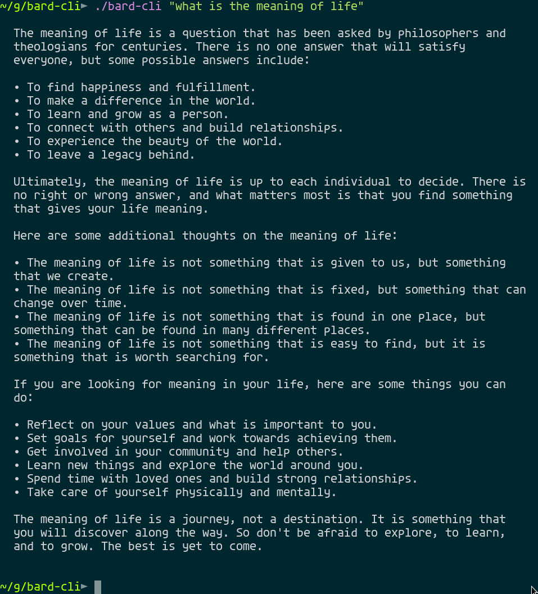
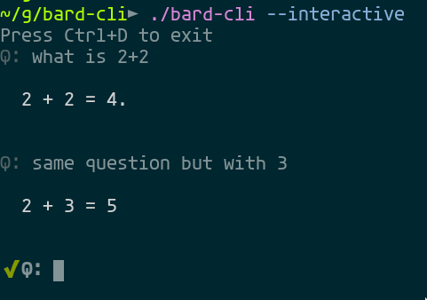

# Gemini (Bard) CLI

Use Gemini in your CLI!

## Installation

```bash
go install github.com/mosajjal/askg@latest
```

or download the binary from [releases](//github.com/mosajjal/askg/releases/latest)

In order to use the CLI, you first need to gain access to Gemini in your browser, and then copy the cookie "__Secure-1PSID" using developer tools. If you don't know how, follow [this guide](https://developer.chrome.com/docs/devtools/application/cookies/)

IMPORTANT NOTE: never share your cookies with anyone, as they can be used to impersonate you and steal your data.

Then create the default configuration file using the following command:

```bash
$ askg --defaultconfig
# 2023-05-15T21:06:42+12:00 INF wrote default config to /home/USER/.askg.yaml
```

and then edit the file to add your cookie.
```bash
$ cat ~/.askg.yaml
cookie: YOURLONG-COOKIE.
log_level: warn
```

then just start using it!

```md
$ askg "what is the meaning of life?"
The meaning of life is a question that has been asked by philosophers and theologians for centuries. There is no one answer that will satisfy everyone, but some possible answers include:

* To find happiness and fulfillment.
* To make a difference in the world.
* To learn and grow as a person.
* To connect with others and build relationships.
* To experience the beauty of the world.
* To leave a legacy behind.

Ultimately, the meaning of life is up to each individual to decide. There is no right or wrong answer, and what matters most is that you find something that gives your life meaning.

Here are some additional thoughts on the meaning of life:

* The meaning of life is not something that is given to us, but something that we create.
* The meaning of life is not something that we find once and for all, but something that we discover and rediscover throughout our lives.
* The meaning of life is not something that is the same for everyone, but something that is unique to each individual.

If you are searching for the meaning of life, I encourage you to explore your own values, beliefs, and experiences. What is important to you? What makes you happy? What do you want to achieve in your life? The answers to these questions may help you to find your own meaning in life.
```

## Use a Proxy

To use a HTTP(s) or SOCKS4/5 proxy to access Google, set `HTTP_PROXY` as well as `HTTPS_PROXY` environment variables before running `askg`. 

## Screenshots






## Use as a neovim plugin

in your neovim config, add the following plugin

```lua
Plug 'mosajjal/askg', {'rtp': 'nvim'}
```

by default, the plugin looks for `askg` in `$HOME/go/bin/askg` and the configuration file at `$HOME/.askg.yaml`

to change that, run the setup function of Gemini using the following

```lua
lua require('askg').setup({askg_path="$HOME/go/bin/askg", askg_config_path="$HOME/.askg.yaml"})
```

## Usage

`
:Askg "write hello world in javascript"
`

the above will open a new vsplit and return the results in the new buffer


